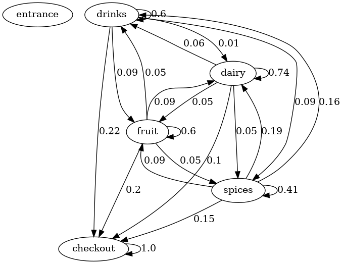

# Supermarket-Simulation
in this project, I simulates custome behaviour in a supermarket with Markov-Chain.

The data used is tracked from supermarket customers during a five-day week.it includes tabular data indicating where customers spent their time.

The customers enter from the entrance,then they can move between four areas freely: fruit,spices,dairy,drinks. Sooner or later, they will enter the checkout area. Once they do, they are considered to have left the shop.

The transition probabilities matrix is calculated to analyze how customers switch between sections of the supermarket. 

### State Diagram

